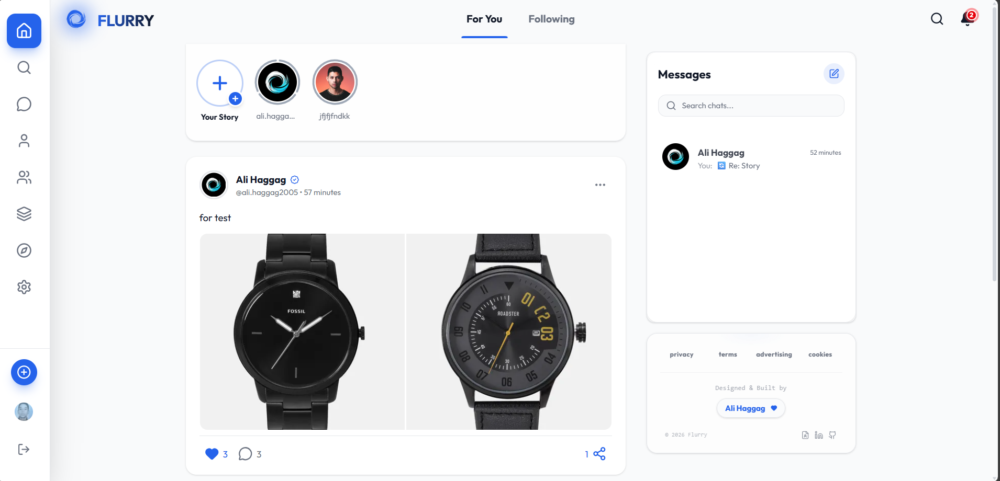

# 🌪️ Flurry - Real-time Social Media Platform

> **Flurry** is a fully functional, mobile-first social media application built with the MERN stack. It bridges the gap between traditional social feeds and instant messaging, offering a seamless, app-like experience on the web.

[](https://www.linkedin.com/in/ali-haggag7)
*(Click the image above to watch the demo video)*

## 🚀 Live Demo
[Click here to visit Flurry](https://flurry-app.vercel.app/)

---

## ✨ Key Features (v2.0 Update)

### 1️⃣ Audio & Video Calling 📹 🆕
- **Peer-to-Peer Communication:** Crystal clear voice and video calls powered by **WebRTC**.
- **Integrated Interface:** Seamless calling experience directly within the chat UI without third-party plugins.
- **Connection Handling:** Smart handling of user availability and connection states.

### 2️⃣ Intelligent Group Chats 🤖 🆕
- **AI-Powered Summaries:** Integrated **Google Gemini AI** to summarize long group conversations instantly with a single click.
- **Interactive Polls:** Create real-time voting polls within groups to make decisions faster.
- **Admin Controls:** Full control over members (remove/add) and system event logging.

### 3️⃣ Enhanced Messaging Experience 💬 🆕
- **CRUD Operations:** Ability to **Edit** and **Delete** messages in real-time for everyone.
- **Rich Media & Voice Notes:** Send images, videos, and record voice notes with live previews.
- **Infinite Scrolling:** Optimized message loading (pagination) for high performance in long chats.
- **Message States:** Detailed status tracking (Pending 🕒 -> Sent ✔️ -> Delivered ✔️✔️ -> Read ✅).

### 4️⃣ Progressive Web App (PWA) & Offline Support 📶 🆕
- **Offline First:** The app remains functional without internet access, serving cached content via **Service Workers**.
- **Smart Sync:** Actions performed offline (like sending messages) are queued and synced automatically when connectivity returns.
- **Push Notifications:** Custom system-wide pop-up notifications for messages and interactions even when the app is in the background.

### 5️⃣ Localization & Accessibility 🌍 🆕
- **Multi-language Support:** Fully localized interface with instant switching between **English (LTR)** and **Arabic (RTL)**.
- **Dynamic Layout:** The UI automatically adapts direction (RTL/LTR) based on the selected language.

---

## 💎 Core Features

### 6️⃣ Advanced Social Feed
- **Full Interactions:** Create, edit, delete, save, and share posts.
- **Threaded Comments:** Infinite nested replies with independent like counters.
- **Auto-Moderation:** Smart system that "soft bans" posts after receiving 5+ reports.
- **Visual Integration:** User stories appear as a status ring around profile pictures in the feed.

### 7️⃣ Real-time Chat (Socket.io)
- **Instant Messaging:** Zero-latency chat with live typing indicators.
- **Media Sharing:** Send images, videos, voice notes, and external links smoothly.
- **Group Management:** Create groups and manage participants easily.

### 8️⃣ Interactive Stories
- **Rich Content:** Support for images, videos, and text with backgrounds.
- **Smart Views:** Segmented status rings indicate viewed/unviewed stories.
- **Direct Replies:** Reply to stories directly into the chat with a quoted reference.

### 9️⃣ Privacy & Security
- **Hard Block System:** Complete isolation between blocked users.
- **Private Accounts:** Content is hidden from non-followers.
- **Active Status Control:** Option to hide "Online" presence.
- **Secure Auth:** Powered by **Clerk** for robust session management.

### 🔟 Performance & Architecture
- **Optimized Rendering:** Utilizing `React.memo` and `useCallback` to prevent unnecessary re-renders.
- **Lazy Loading:** Heavy components (like Emoji Picker) load only when needed.
- **Optimistic UI:** Instant feedback on likes/comments before server response.
- **Rate Limiting:** Backend protection against spam and DDoS attacks.

---

## 🛠️ Tech Stack

| Domain | Technologies |
| :--- | :--- |
| **Frontend** | React.js, Tailwind CSS, Framer Motion, Lucide React, **i18next** |
| **Backend** | Node.js, Express.js, Socket.io |
| **Real-time & AI** | **WebRTC (SimplePeer)**, **Google Gemini API** |
| **Database** | MongoDB, Mongoose |
| **Auth** | Clerk |
| **Media & PWA** | ImageKit CDN, **Workbox (Service Workers)** |

---

## 💻 Running Locally

1. **Clone the repository**
   ```bash
   git clone [https://github.com/Ali-Haggag7/flurry-app.git](https://github.com/Ali-Haggag7/flurry-app.git)
   cd flurry-app

2. **Install Dependencies**
```bash
# Install server dependencies
    cd server
    npm install

# Return to root then install client dependencies
    cd ../client
    npm install

```
3. **Environment Variables Create a .env file in both client and server directories and add your keys (Clerk, MongoDB, ImageKit).**

4. **Run the App**

```bash
# Run Backend (Open new terminal)
cd server
npm start

```
```bash
# Run Frontend (Open separate terminal)
cd client
npm run dev

```

---

## 📄 License
This project is open source and available under the [MIT License](LICENSE). 
Created by **Ali Haggag**. © 2026 All rights reserved.
